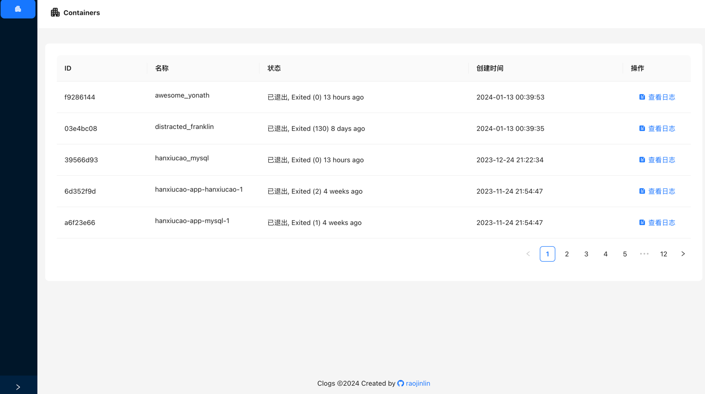
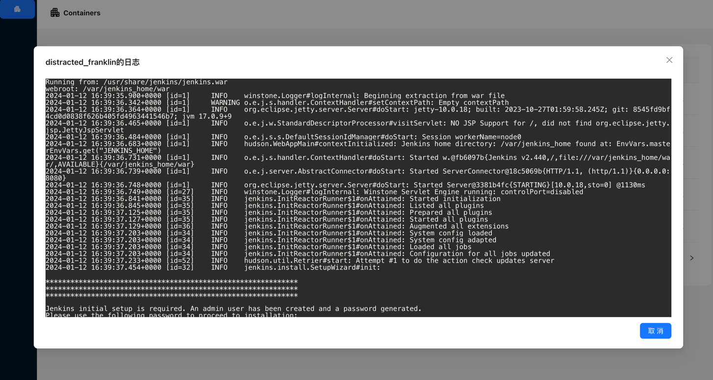
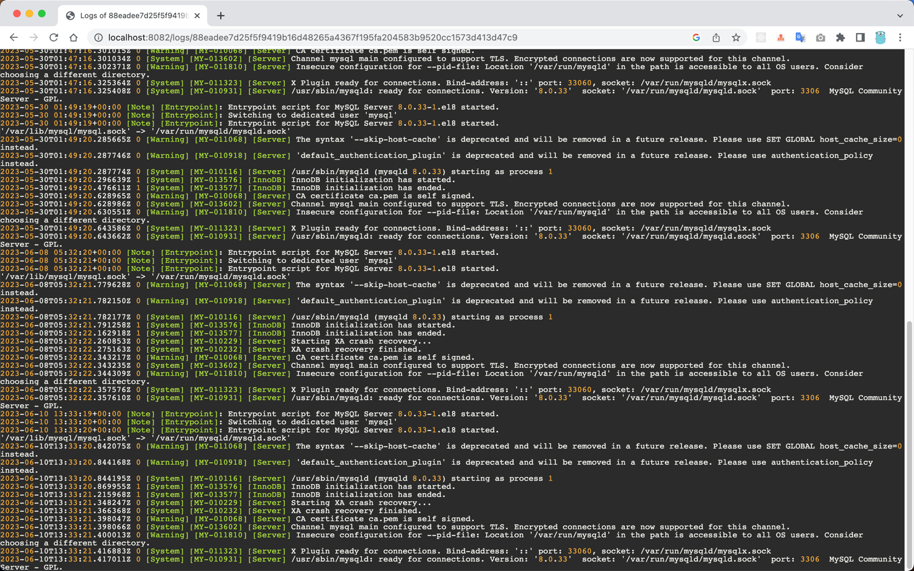

# clogs
clogs (Container Logs) 是一个使用 Go 语言编写的小型开源项目，基于 Gin 框架。它为 Docker 容器提供HTTP日志接口，并提供一个Web界面实时查看容器日志。


## 特性
1. 为 Docker 容器提供HTTP日志接口：clogs 使用 SSE(Server-Sent Event) 技术，允许用户以实时、高效的方式获取 Docker 容器的日志信息。
2. 使用 highlight.js 支持语法高亮：项目集成了 highlight.js，使用户可以以更好的方式阅读和分析日志内容。
3. 平台无关且易于集成：clogs 设计独立、平台无关，非常易于集成到现有系统中。无论是 Linux、Windows 还是其他操作系统，无论是 Docker、Kubernetes 还是其他容器平台，该项目都可以轻松与其配合使用。
4. 支持查看容器内的日志文件或容器运行日志：clogs 支持实时查看容器内的日志文件，也可以输出容器的运行日志。用户可以通过指定日志文件路径使用 tail 命令查看日志内容。
5. 可以使用 Docker 运行，也可以独立运行：该项目既支持使用 Docker 运行，方便部署和管理，也可以选择在任何支持 Go 语言的环境中独立运行。

## 安装和配置
在开始使用 clogs 之前，请确保您的系统满足以下要求：

1. 已安装 Go 编程语言环境。
2. 可以访问 Docker 或已安装 Docker（如果选择使用 Docker 运行）。

### 安装步骤

1. 克隆项目仓库到本地：
```bash
git clone https://github.com/raojinlin/clogs.git
```

2. 进入项目目录：
```shell
cd clogs
```

3. 安装依赖：
```shell
go mod tidy
```

4. 运行项目
```shell
go run .
```

#### 使用docker

1. 构建镜像
```shell
doker build -t clogs -f ./Dockerfile .
```

2. 运行镜像
```shell
docker run -d --restart=always --name clogs -it -v /var/run/docker.sock:/var/run/docker.sock clogs
```

### 配置选项

clogs 提供了以下命令行参数来配置项目：
- -port (数字): 监听的端口，默认为 8082。

您可以通过以下命令行示例来启动 clogs 并指定监听的端口：

```shell
go run . -port=8082
```

### 访问
在浏览器打开[http://localhost:8082](http://localhost:8082)即可访问




## 接口
提供两个接口，webui和SSE接口

### SSE 接口

#### GET /api/container/logs/:container
通过 SSE 获取容器的日志信息。接口返回的数据是Base64编码，使用双引号包裹起来的字符串，使用时需要将前后的双引号去除解码。
响应数据流格式如下：

```text
event:message
data:"MTAuMS4wLjEgLSAtIFsyMS9KdW4vMjAyMzowMDo1MjoxNyArMDAwMF0gIkdFVCAvIEhUVFAvMS4xIiAyMDAgNiAiIiAia3ViZS1wcm9iZS8xLjI1Igo="
```

请求参数
- container (字符串): 容器的名称或者ID。

查询参数
- tail (数字): 指定输出的日志行数。
- logFile (字符串): 默认为 "stdout"，输出容器的运行日志。也可以指定日志文件的路径，使用 tail 命令查看日志。
- showStderr (布尔值): 默认为 false，是否输出标准错误日志。
- showStdout (布尔值): 默认为 true，是否输出标准输出日志。
- follow (布尔值): 是否实时输出日志内容。

以下是使用示例：
1. 使用EventSource接口
```javascript
const eventSource = new EventSource('/api/container/logs/my-container?tail=100&logFile=app.log&showStderr=true&showStdout=true&follow=false');
eventSource.onmessage = event => {
    const decodeData = atob(event.data.replace(/^"|"$/g, ''))
};
```

2. 使用curl
```shell
curl 'http://127.0.0.1:8082/api/container/logs/2a8b8d9c5c62?showStderr=true&showStdout=true&follow=true&tail=15&logFile=stdout' -i
HTTP/1.1 200 OK
Cache-Control: no-cache
Content-Type: text/event-stream
Date: Wed, 21 Jun 2023 00:53:55 GMT
Transfer-Encoding: chunked

event:message
data:"MTAuMS4wLjEgLSAtIFsyMS9KdW4vMjAyMzowMDo1MjoxNyArMDAwMF0gIkdFVCAvIEhUVFAvMS4xIiAyMDAgNiAiIiAia3ViZS1wcm9iZS8xLjI1Igo="
```

### 浏览器页面
#### GET /logs/:container

提供一个页面用于实时查看容器日志。

请求参数
- container (字符串): 容器的名称或者ID。

查询参数
- logFile (字符串): 日志文件的路径。
- tail (数字): 默认为 1500，显示的日志行数。

请在浏览器中访问上述 URL 来查看容器的实时日志内容。


#### 截图


## 使用nginx部署
```
location /logs {
    proxy_pass http://172.17.0.4:8082/logs;
}

location /api/container {
    proxy_pass http://172.17.0.4:8082/api/container;
    proxy_http_version 1.1;
    proxy_set_header Connection "";

    proxy_buffering off;
    proxy_connect_timeout 1d;
    proxy_send_timeout 1d;
    proxy_read_timeout 1d;
}
```
# 贡献
如果您对 clogs 感兴趣并希望做出贡献，您可以执行以下步骤：

1. Fork 项目仓库到您自己的 GitHub 账号。
2. 进行修改和改进。
3. 提交 Pull Request，将您的改进合并到原始项目中。

感谢您的贡献！